## Введение

Цель работы — построить и сравнить модели регрессии для прогнозирования массы тела пингвинов по морфологическим и категориальным признакам, а также оценить изменение качества после снижения размерности методом главных компонент (PCA).

Для достижения цели решаются следующие задачи:

- изучить структуру исходного набора данных и распределения переменных;
- обработать пропущенные значения и преобразовать категориальные признаки;
- исследовать корреляции между числовыми переменными;
- оценить мультиколлинеарность числовых предикторов с помощью VIF;
- обучить Linear Regression, Ridge и Lasso с подбором гиперпараметров и кросс-валидацией;
- оценить модели по RMSE, коэффициенту детерминации $R^2$ и MAPE;
- применить PCA после стандартизации признаков и повторить моделирование;
- сопоставить результаты до и после снижения размерности.

В работе используются линейная регрессия, минимизирующая сумму квадратов остатков; Ridge-регрессия с $L_2$-регуляризацией; Lasso-регрессия с $L_1$-регуляризацией; PCA, преобразующий исходные признаки в ортогональные главные компоненты; и пятикратная кросс-валидация для оценки моделей и подбора параметра регуляризации. Данные разделяются на обучающую и тестовую части в отношении 80/20. Все преобразования, используемые для обучения моделей, организованы в конвейеры `Pipeline`.

## Описание датасета

В проекте используется локальный файл `data/penguins.csv`, предоставленный вместе с проектом. Он содержит **1000 наблюдений и 7 столбцов**. Отдельная информация о происхождении именно этой версии CSV и её лицензии в приложенных файлах не указана; поэтому файл рассматривается как предоставленный исходный набор данных, а не как автоматически подтверждённая копия конкретной публикации. Исходное исследование Palmer Penguins приведено в списке литературы как предметный источник о данных пингвинов.

**Таблица 1 — Переменные исходного набора данных**

| Имя переменной | Тип | Описание |
|:---|:---|:---|
| `species` | Категориальная, текстовая | Вид пингвина |
| `island` | Категориальная, текстовая | Остров наблюдения |
| `culmen_length_mm` | Числовая, вещественная | Длина клюва, мм |
| `culmen_depth_mm` | Числовая, вещественная | Глубина клюва, мм |
| `flipper_length_mm` | Числовая, вещественная | Длина ласты, мм |
| `body_mass_g` | Числовая, вещественная | Масса тела, г; целевая переменная |
| `sex` | Категориальная, текстовая | Пол |

В качестве целевой переменной выбрана `body_mass_g`. Это непрерывная числовая величина, поэтому постановка задачи соответствует регрессии и допускает применение Linear Regression, Ridge и Lasso с оценкой RMSE, $R^2$ и MAPE. Переменная `species` используется как один из предикторов и кодируется как категориальный признак. В исходном файле отсутствует 10 значений целевой переменной; такие строки исключаются из моделирования, но сохраняются при построении описательных графиков, где пропуски просто не отображаются.

### Распределения числовых признаков

Гистограммы приведены для оценки диапазонов, асимметрии, концентрации наблюдений и возможных необычных значений. Они также помогают понять, насколько разнообразны измерения и целевая переменная до обучения моделей.

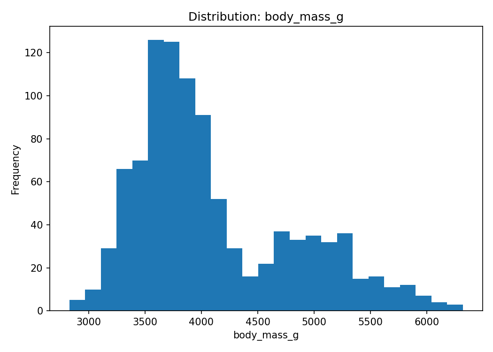

*Рисунок 1. Распределение массы тела пингвинов (`body_mass_g`).*

Гистограмма показывает частоты наблюдений по диапазонам массы тела. Распределение не следует трактовать как идеально нормальное: в выборке представлены разные виды пингвинов, которые могут отличаться по массе. Для регрессионной задачи это означает, что модель должна описывать массу по совокупности морфологических и категориальных характеристик.

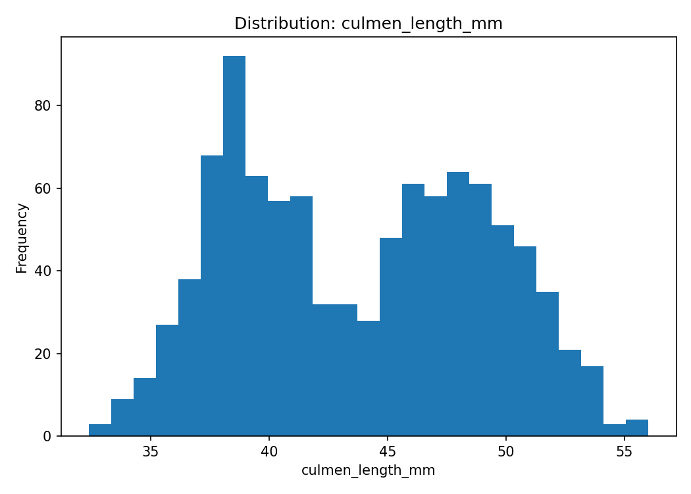

*Рисунок 2. Распределение длины клюва (`culmen_length_mm`).*

На графике отражено распределение длины клюва в миллиметрах. Разброс значений указывает на неоднородность морфологических характеристик внутри выборки и может быть связан с различиями между видами. При построении моделей этот признак используется совместно с глубиной клюва, длиной ласты и категориальными переменными.

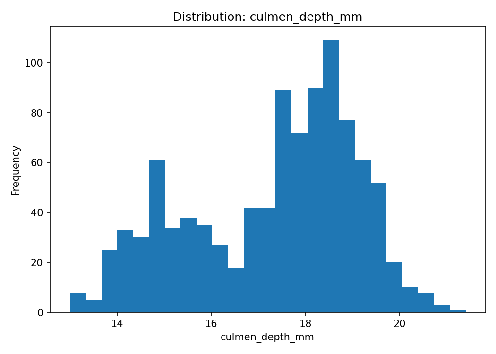

*Рисунок 3. Распределение глубины клюва (`culmen_depth_mm`).*

Гистограмма позволяет оценить диапазон глубины клюва и концентрацию наблюдений в отдельных интервалах. Форма распределения может отражать различия между группами пингвинов. Сам по себе график не устанавливает причинной связи с массой тела, поэтому далее рассматриваются диаграммы рассеяния и корреляции.

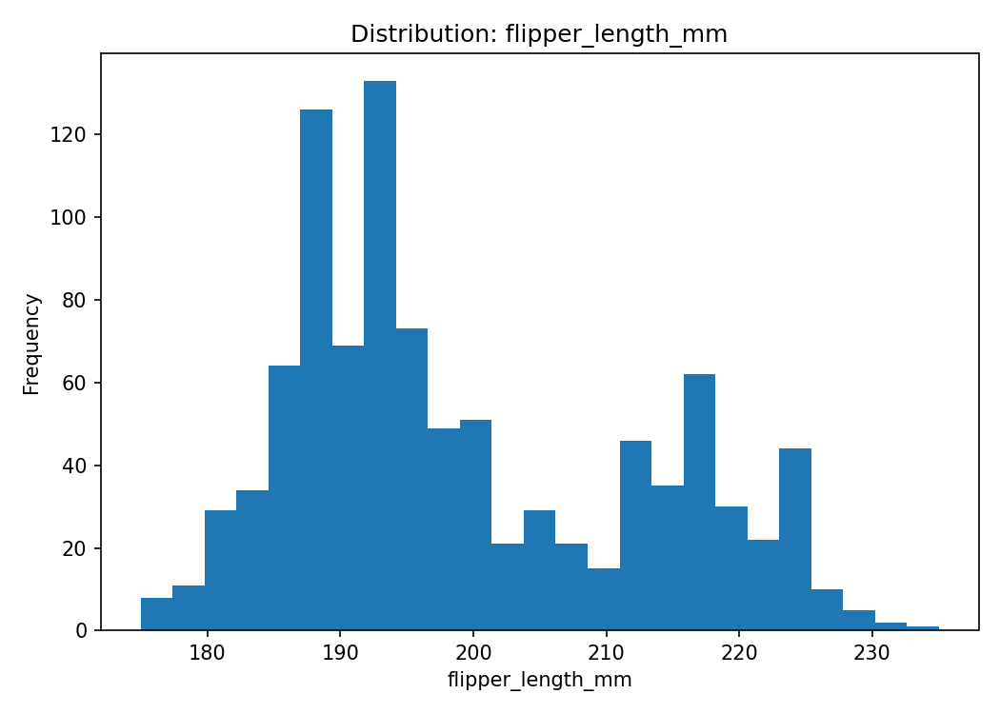

*Рисунок 4. Распределение длины ласты (`flipper_length_mm`).*

Гистограмма демонстрирует изменчивость длины ласты в исследуемой выборке. Признак биологически связан с размерами тела и далее проверяется на наличие линейной связи с целевой переменной. Пропущенные значения не входят в построение гистограммы.

### Масса тела по видам

Сравнение целевой переменной между видами позволяет увидеть межгрупповые различия, которые могут объяснять часть вариации массы тела.

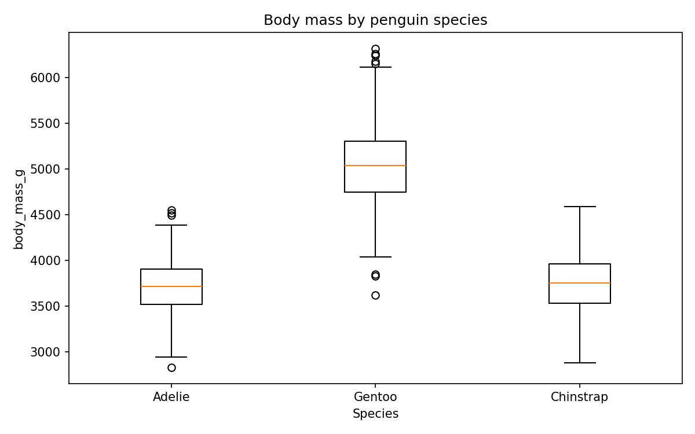

*Рисунок 5. Распределение массы тела по видам пингвинов.*

Диаграмма размаха сравнивает медианы, межквартильные интервалы и потенциальные выбросы массы тела для каждого вида. Различия между группами показывают, что вид может быть информативным категориальным предиктором. Наличие перекрытия распределений при этом означает, что одного вида недостаточно для точного прогноза массы отдельного наблюдения.

### Связь массы тела с морфологическими признаками

Диаграммы рассеяния используются для предварительной оценки направления и формы зависимости целевой переменной от каждого числового предиктора; окраска по видам помогает увидеть возможную структуру групп.

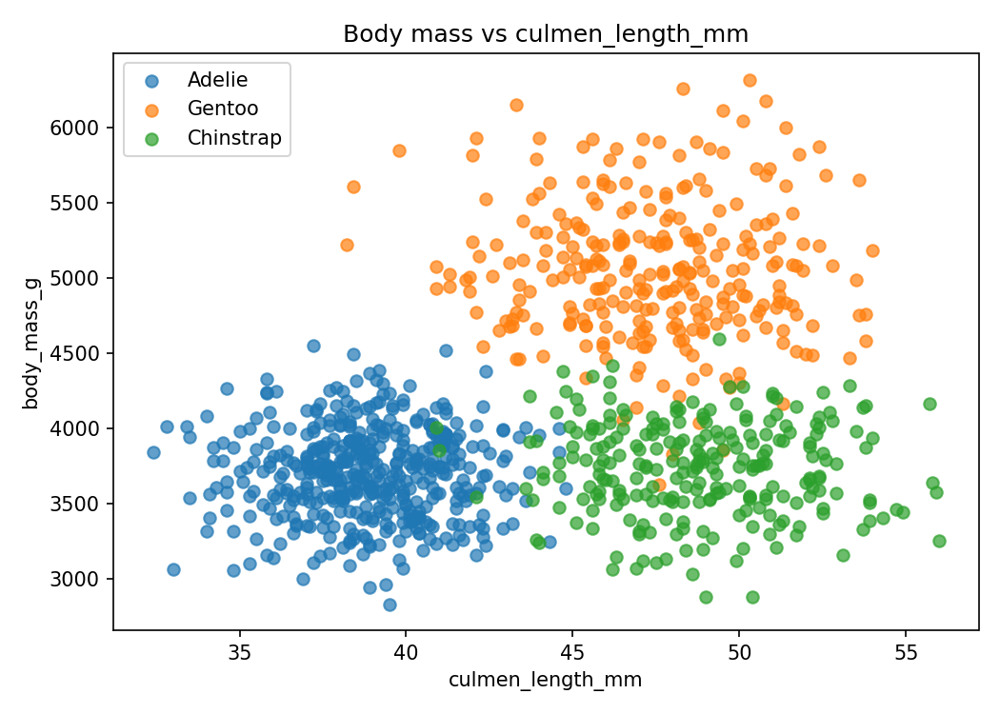

*Рисунок 6. Зависимость массы тела от длины клюва.*

На диаграмме показано соотношение длины клюва и массы тела, отдельно для наблюдений разных видов. В целом связь положительная, но точки образуют группы и имеют заметный разброс. Это указывает на то, что линейная зависимость по одному признаку не полностью описывает массу тела и что полезно учитывать вид и другие измерения.

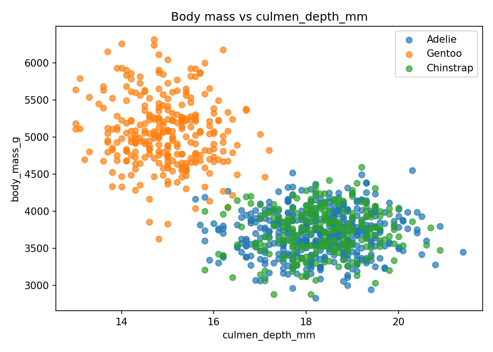

*Рисунок 7. Зависимость массы тела от глубины клюва.*

На графике наблюдается выраженная отрицательная линейная связь в объединённой выборке. Такая связь может быть обусловлена в том числе различиями между видами, поэтому её нельзя автоматически интерпретировать как причинный эффект. Признак сохраняется в моделировании, поскольку он может добавлять информацию совместно с другими характеристиками.

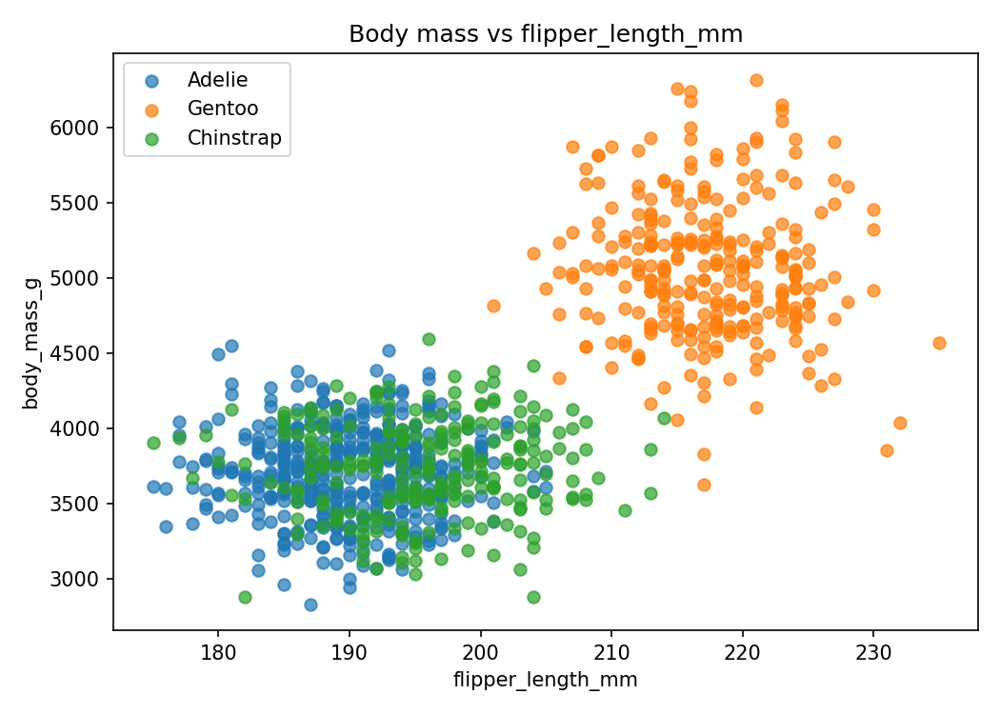

*Рисунок 8. Зависимость массы тела от длины ласты.*

Диаграмма показывает выраженную положительную связь: при большей длине ласты масса тела в среднем также выше. При этом присутствует группировка наблюдений по видам, а также разброс внутри групп. Это согласуется с корреляционным анализом и делает длину ласты потенциально информативным предиктором.

### Корреляционная матрица

Корреляционная матрица приведена для количественной оценки линейной связи между числовыми переменными. Коэффициенты Пирсона лежат в диапазоне от $-1$ до $1$: знак отражает направление связи, а абсолютная величина — её линейную выраженность.

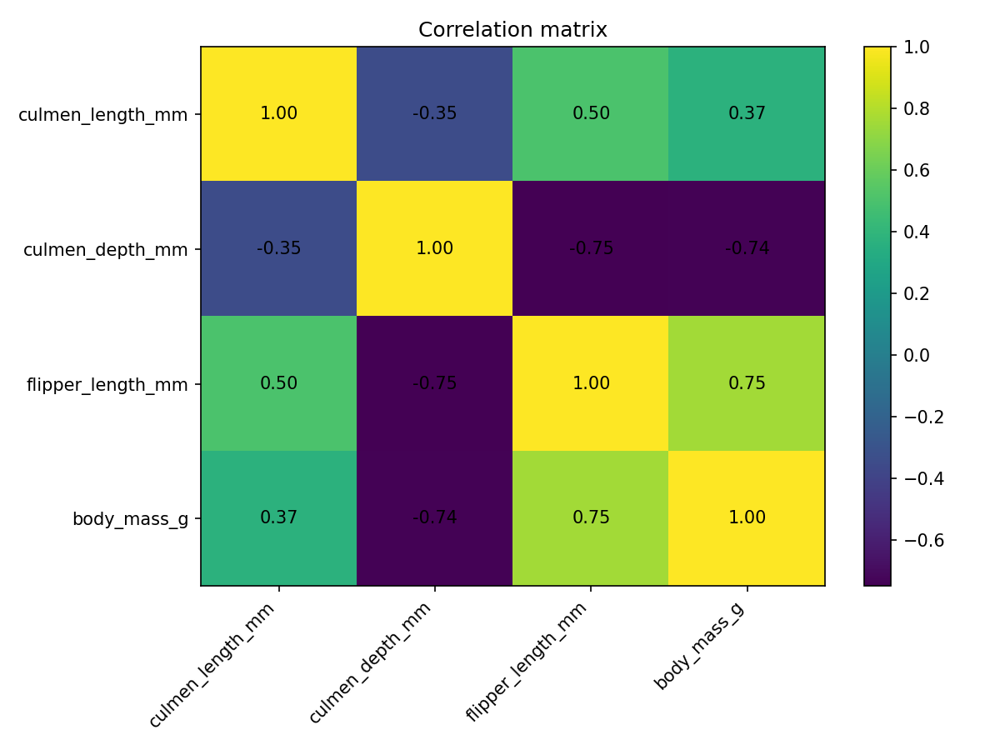

*Рисунок 9. Корреляционная матрица числовых признаков и целевой переменной.*

Наиболее выраженная положительная корреляция с массой тела наблюдается у длины ласты, а наиболее выраженная отрицательная — у глубины клюва. Длина клюва имеет положительную, но более умеренную связь с массой. Корреляция между предикторами также заметна, поэтому далее дополнительно рассчитывается VIF.

**Таблица 2 — Коэффициенты корреляции Пирсона**

| Переменная | Длина клюва | Глубина клюва | Длина ласты | Масса тела |
|:---|---:|---:|---:|---:|
| Длина клюва (`culmen_length_mm`) | 1.0000 | -0.3457 | 0.5014 | 0.3722 |
| Глубина клюва (`culmen_depth_mm`) | -0.3457 | 1.0000 | -0.7491 | -0.7398 |
| Длина ласты (`flipper_length_mm`) | 0.5014 | -0.7491 | 1.0000 | 0.7547 |
| Масса тела (`body_mass_g`) | 0.3722 | -0.7398 | 0.7547 | 1.0000 |

Значения таблицы взяты из `results/correlation_matrix.csv`. Длина ласты коррелирует с массой тела на уровне $r=0.7547$, а глубина клюва — на уровне $r=-0.7398$. Между глубиной клюва и длиной ласты также наблюдается сильная отрицательная корреляция ($r=-0.7491$), что указывает на возможную мультиколлинеарность числовых предикторов.

## Подготовка данных

До обучения выполняются следующие преобразования:

- **Целевая переменная.** Строки, в которых отсутствует `body_mass_g`, удаляются с помощью `dropna(subset=[TARGET])`. После исключения таких строк остаётся 990 наблюдений для моделирования.
- **Числовые признаки.** Пропуски заполняются медианой посредством `SimpleImputer(strategy="median")`.
- **Категориальные признаки.** Пропуски заполняются наиболее частым значением посредством `SimpleImputer(strategy="most_frequent")`.
- **Кодирование.** Для категориальных признаков используется `OneHotEncoder(drop="first", handle_unknown="ignore")`. Первая категория исключается, чтобы уменьшить избыточность представления категорий; неизвестные категории при преобразовании не приводят к ошибке.
- **Стандартизация.** Числовые признаки в моделях до PCA стандартизируются с помощью `StandardScaler`. Для PCA стандартизируется весь преобразованный набор признаков, включая закодированные категориальные переменные.
- **Разделение выборки.** Используется `train_test_split(test_size=0.20, random_state=42)`: обучающая часть составляет 80%, тестовая — 20%.

В исходном файле обнаружено по 10 пропусков в `culmen_length_mm`, `culmen_depth_mm`, `flipper_length_mm`, `body_mass_g` и `sex`; в `species` и `island` пропусков нет. Пропуски признаков не требуют удаления целых строк: они заполняются внутри конвейеров предобработки.

Предобработка включена в `Pipeline` и `ColumnTransformer`. Это важно для защиты от утечки данных: медианы, наиболее частые категории, параметры масштабирования, кодирование и преобразование PCA обучаются на соответствующей обучающей части внутри каждого разбиения кросс-валидации. Тестовая выборка не используется для подгонки этих преобразований и остаётся независимой оценкой качества.

## Ход работы

### 4.1. Анализ мультиколлинеарности (VIF)

Для оценки мультиколлинеарности числовых предикторов рассчитывается коэффициент инфляции дисперсии (Variance Inflation Factor, VIF). Для каждого признака строится вспомогательная регрессия этого признака на остальные предикторы. Коэффициент определяется формулой

$$VIF_j = \frac{1}{1-R_j^2},$$

где $R_j^2$ — коэффициент детерминации вспомогательной регрессии для $j$-го признака. Чем выше VIF, тем сильнее данный признак линейно объясняется другими предикторами. В этой работе VIF рассчитывается по трём числовым предикторам после заполнения пропусков медианами обучающей выборки; категориальные фиктивные переменные в данный расчёт не включаются.

**Таблица 3 — Значения VIF числовых предикторов**

| Признак | VIF |
|:---|---:|
| `culmen_length_mm` | 93.3063 |
| `culmen_depth_mm` | 41.9813 |
| `flipper_length_mm` | 125.8149 |

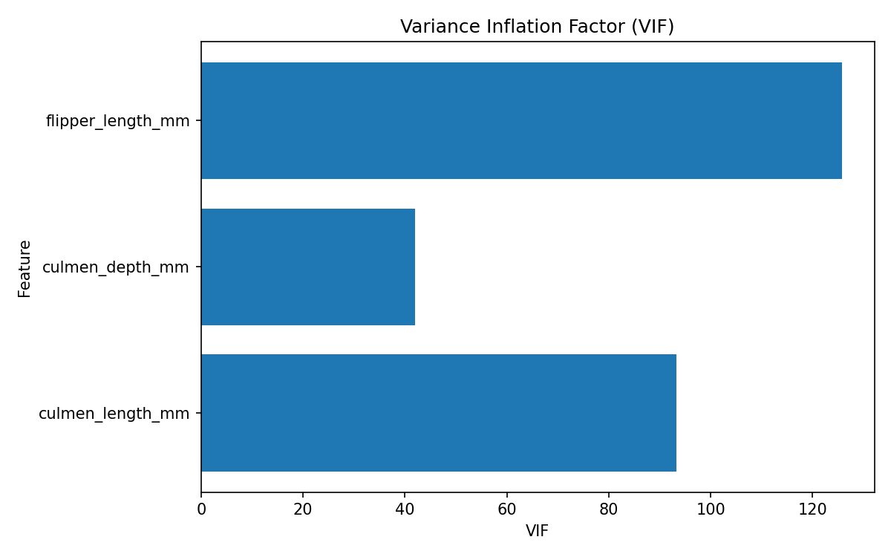

*Рисунок 10. Коэффициенты инфляции дисперсии для числовых предикторов.*

Все три значения VIF существенно превышают часто используемые диагностические ориентиры 5 или 10. Наибольшее значение наблюдается у длины ласты, далее следуют длина и глубина клюва. Это подтверждает наличие сильной мультиколлинеарности среди числовых предикторов; PCA рассматривается как способ получить ортогональное представление признаков, хотя он не гарантирует повышения точности прогноза.

### 4.2. Регрессионные модели до PCA

До уменьшения размерности обучаются три модели:

- **Linear Regression** — линейная регрессия, оценивающая коэффициенты методом наименьших квадратов;
- **Ridge** — линейная регрессия с $L_2$-штрафом, уменьшающим величины коэффициентов;
- **Lasso** — линейная регрессия с $L_1$-штрафом, способным приводить отдельные коэффициенты к нулю.

Для Ridge и Lasso параметр регуляризации `alpha` подбирается с помощью `GridSearchCV`. Для Ridge проверяется сетка `np.logspace(-3, 3, 13)`, для Lasso — `np.logspace(-3, 1, 12)`. Для Linear Regression сетка параметров не требуется. Кросс-валидация выполняется с помощью `KFold(n_splits=5, shuffle=True, random_state=42)`. Критерий подбора — `neg_root_mean_squared_error`; при представлении результатов знак меняется, чтобы получить положительное значение RMSE.

Для оценки качества используются следующие метрики:

$$RMSE = \sqrt{\frac{1}{n}\sum_{i=1}^{n}(y_i-\hat{y}_i)^2},$$

$$R^2 = 1-\frac{\sum_{i=1}^{n}(y_i-\hat{y}_i)^2}{\sum_{i=1}^{n}(y_i-\bar{y})^2},$$

$$MAPE = \frac{100\%}{n}\sum_{i=1}^{n}\left|\frac{y_i-\hat{y}_i}{y_i}\right|.$$

Здесь $y_i$ — фактическое значение, $\hat{y}_i$ — прогноз, $\bar y$ — среднее фактических значений, $n$ — число наблюдений. Для RMSE и MAPE меньшие значения означают меньшую ошибку; для $R^2$ более высокое значение означает, что модель объясняет большую долю вариации целевой переменной.

**Таблица 4 — Результаты регрессии до PCA**

| Model | RMSE | R2 | MAPE_% | Best_CV_RMSE | Best_Params |
|:---|---:|---:|---:|---:|:---|
| LinearRegression | 348.3330 | 0.7455 | 6.7839 | 358.2812 | `{}` |
| Ridge | 348.3320 | 0.7455 | 6.7839 | 358.2814 | `model__alpha = 0.001` |
| Lasso | 348.2904 | 0.7455 | 6.7879 | 358.0299 | `model__alpha = 0.8111308308` |

Таблица построена по `results/results_before_pca.csv`; RMSE измеряется в граммах. Все три модели показывают практически одинаковое качество: RMSE составляет около 348.3 г, $R^2$ — около 0.7455, MAPE — около 6.78%. Небольшое численное преимущество Lasso по RMSE не свидетельствует о существенном улучшении, поскольку разница между моделями крайне мала.

### 4.3. Устранение мультиколлинеарности с помощью PCA

Метод главных компонент преобразует исходное пространство признаков в набор взаимно ортогональных линейных комбинаций. Перед PCA выполняются заполнение пропусков, кодирование категориальных переменных и стандартизация преобразованной матрицы. Конвейер имеет следующую структуру:

`SimpleImputer` для числовых признаков и `SimpleImputer` для категориальных признаков → `OneHotEncoder(drop="first", handle_unknown="ignore")` для категориальных данных → `StandardScaler` для всех преобразованных признаков → `PCA(n_components=0.95)`.

Порог `n_components=0.95` означает, что выбирается минимальное число компонент, необходимое для сохранения не менее 95% дисперсии преобразованных признаков. Важно, что PCA применяется только к предикторам, а целевая переменная `body_mass_g` не входит в матрицу, по которой вычисляются главные компоненты.

Для оценки вклада отдельных компонент используется график собственных значений в форме отношения объяснённой дисперсии — scree plot.

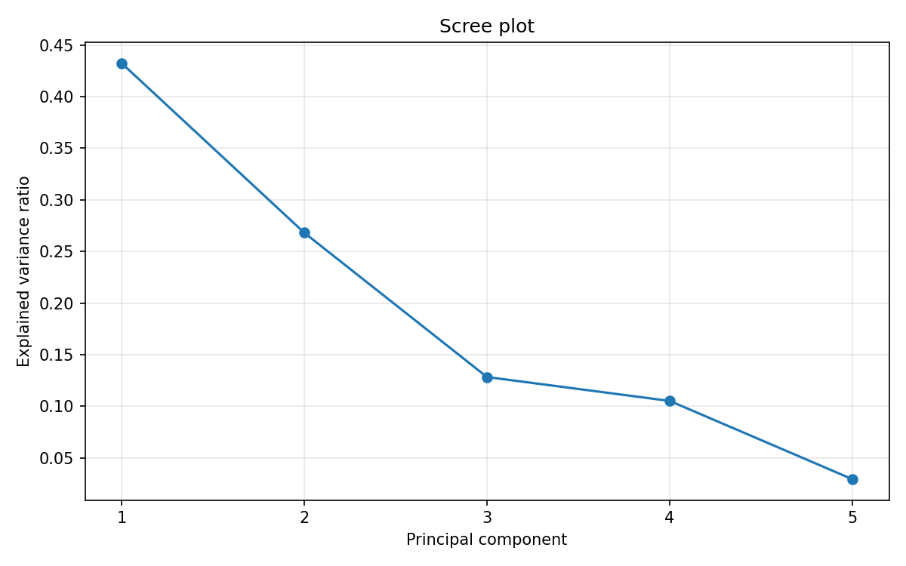

*Рисунок 11. Доля объяснённой дисперсии отдельными главными компонентами.*

График показывает, какую долю общей дисперсии преобразованных признаков объясняет каждая компонента. Вклад компонент неодинаков, поэтому первые компоненты несут большую часть информации о вариации данных. Однако scree plot описывает вариацию признаков, а не напрямую качество прогноза массы тела.

Дополнительно используется накопленная объяснённая дисперсия, чтобы проверить выполнение установленного порога 95%.

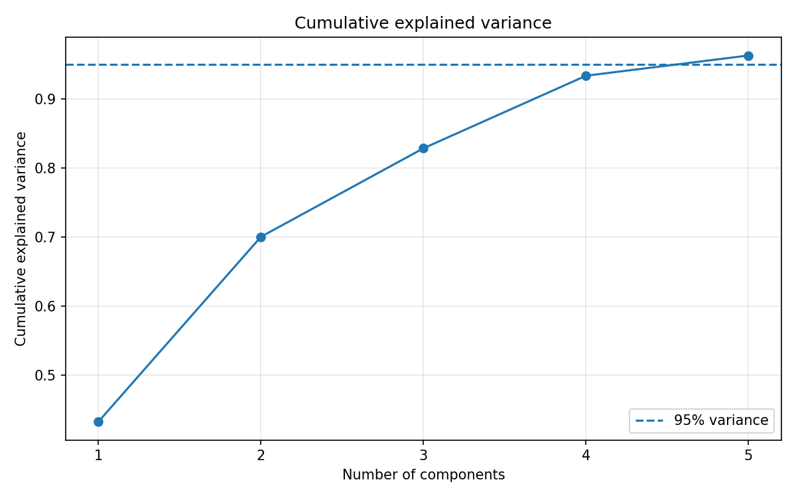

*Рисунок 12. Накопленная доля объяснённой дисперсии PCA.*

Пунктирная горизонтальная линия обозначает порог 95%. По результатам выполненного расчёта сохранено **5 главных компонент**, совокупно объясняющих **0.9632818716**, то есть примерно **96.33% дисперсии**. Следовательно, преобразование сокращает пространство признаков до пяти компонент, сохраняя долю дисперсии выше установленного порога.

### 4.4. Регрессионные модели после PCA

После PCA Linear Regression, Ridge и Lasso обучаются заново на главных компонентах. Процедура оценки сохраняет тот же принцип разделения на обучающую и тестовую выборки, ту же пятикратную кросс-валидацию и тот же критерий подбора `neg_root_mean_squared_error`. Для Ridge и Lasso параметр `alpha` повторно выбирается GridSearchCV уже в пространстве главных компонент.

**Таблица 5 — Результаты регрессии после PCA**

| Model | RMSE | R2 | MAPE_% | Best_CV_RMSE | PCA_components | PCA_explained_variance | Best_Params |
|:---|---:|---:|---:|---:|---:|---:|:---|
| LinearRegression | 363.5835 | 0.7227 | 7.0916 | 380.6899 | 5 | 0.9632818716 | `{}` |
| Ridge | 363.5724 | 0.7227 | 7.0913 | 380.6898 | 5 | 0.9632818716 | `model__alpha = 0.3162277660` |
| Lasso | 363.5833 | 0.7227 | 7.0916 | 380.6899 | 5 | 0.9632818716 | `model__alpha = 0.001` |

Значения приведены по `results/results_after_pca.csv`. После преобразования метрики трёх моделей вновь оказываются очень близкими друг к другу. По сравнению с моделями без PCA, тестовый RMSE увеличился примерно до 363.6 г, а $R^2$ снизился примерно до 0.7227, что указывает на ухудшение прогноза на тестовой выборке после сокращения размерности.

### 4.5. Сравнение результатов до и после PCA

Для итогового сопоставления используются объединённая таблица `results/results.csv` и графики тестовых RMSE и $R^2$. Они позволяют сравнить не только относительные изменения метрик, но и устойчивость различий между тремя алгоритмами.

**Таблица 6 — Сводное сравнение моделей до и после PCA**

| Этап | Model | RMSE | R2 | MAPE_% | Best_CV_RMSE | PCA_components | PCA_explained_variance |
|:---|:---|---:|---:|---:|---:|---:|---:|
| До PCA | LinearRegression | 348.3330 | 0.7455 | 6.7839 | 358.2812 | н/д | н/д |
| До PCA | Ridge | 348.3320 | 0.7455 | 6.7839 | 358.2814 | н/д | н/д |
| До PCA | Lasso | 348.2904 | 0.7455 | 6.7879 | 358.0299 | н/д | н/д |
| После PCA | LinearRegression | 363.5835 | 0.7227 | 7.0916 | 380.6899 | 5 | 0.9632818716 |
| После PCA | Ridge | 363.5724 | 0.7227 | 7.0913 | 380.6898 | 5 | 0.9632818716 |
| После PCA | Lasso | 363.5833 | 0.7227 | 7.0916 | 380.6899 | 5 | 0.9632818716 |

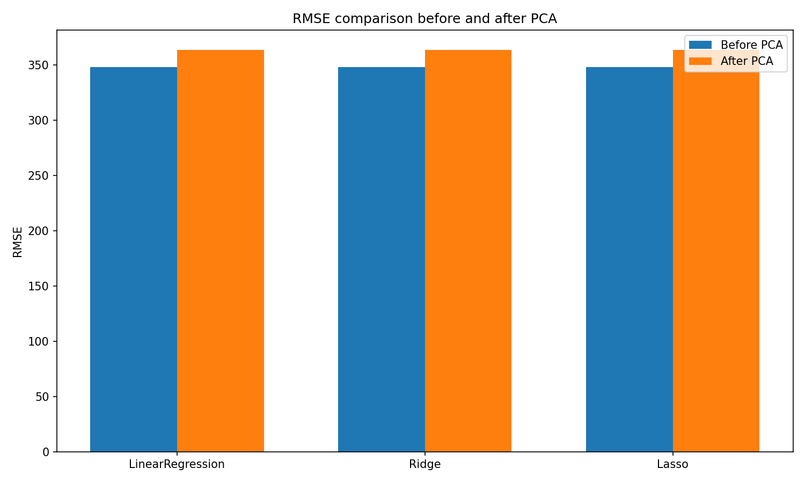

*Рисунок 13. Сравнение RMSE до и после PCA.*

Для каждой из трёх моделей RMSE после PCA выше, чем до преобразования. Это означает, что на использованном разбиении тестовые прогнозы после снижения размерности в среднем дальше от фактических значений массы тела. Различия между Linear Regression, Ridge и Lasso внутри каждого этапа значительно меньше, чем различие между этапами до и после PCA.

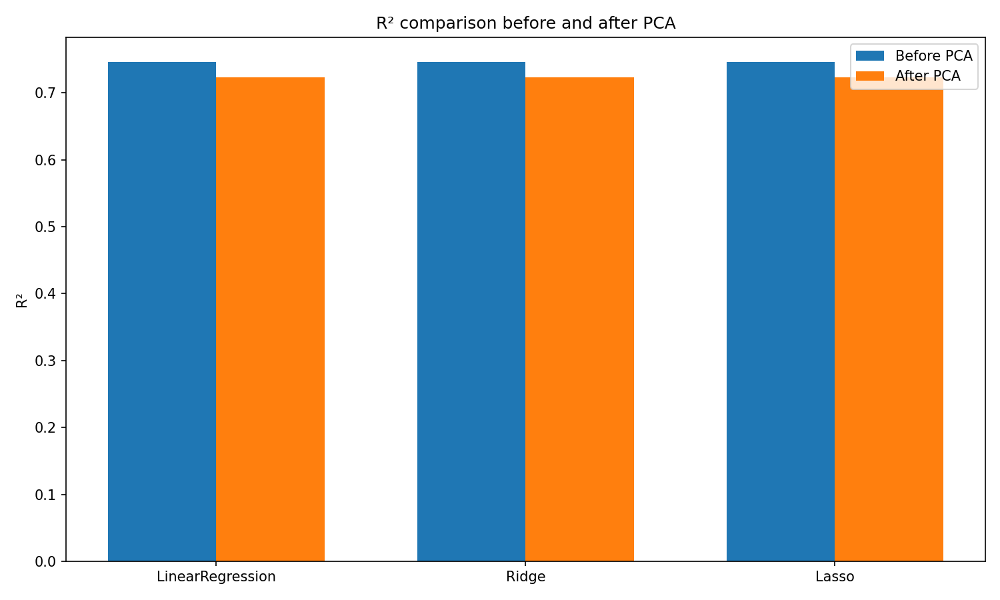

*Рисунок 14. Сравнение коэффициента детерминации до и после PCA.*

После PCA коэффициент $R^2$ снижается с приблизительно 0.7455 до 0.7227 для всех трёх моделей. Одновременно MAPE увеличивается с диапазона около 6.78% до диапазона около 7.09%. Несмотря на сохранение примерно 96.33% дисперсии признаков, PCA не гарантирует сохранения именно той информации, которая наиболее полезна для предсказания целевой переменной; в данной задаче часть прогностически значимой информации могла оказаться в отброшенных компонентах.

В целом регуляризация почти не меняет качество по сравнению с обычной линейной регрессией. Это согласуется с близкими метриками до и после PCA для всех трёх моделей. При этом высокие VIF указывают на выраженную линейную зависимость между числовыми предикторами, а результаты PCA показывают компромисс между сокращением размерности и качеством прогноза.

## Заключение

В работе выполнен полный цикл регрессионного анализа предоставленного набора данных о пингвинах: исследована структура данных, построены графики распределений и зависимостей, обработаны пропуски, закодированы категориальные признаки, рассчитаны корреляции и VIF, обучены Linear Regression, Ridge и Lasso, выполнены подбор параметров и пятикратная кросс-валидация. Затем применён PCA с порогом сохранения дисперсии 95%, после чего модели обучены и оценены повторно.

До PCA наилучшее значение тестового RMSE среди представленных результатов составляет **348.2904 г** у Lasso; значение $R^2$ для этой модели равно **0.7455**, MAPE — **6.7879%**. После PCA сохранено **5 компонент**, объясняющих **96.3282% дисперсии**. После преобразования RMSE составляет примерно **363.57–363.58 г**, $R^2$ — примерно **0.7227**, MAPE — примерно **7.09%**. Следовательно, PCA в этой реализации не улучшил качество регрессии, хотя подтвердил возможность компактного представления признаков и дал ортогональное пространство компонент.

Значения VIF для исходных числовых предикторов находятся в диапазоне от **41.9813** до **125.8149**, что указывает на сильную мультиколлинеарность. В дальнейшем можно проверить нелинейные алгоритмы, например случайный лес или градиентный бустинг; разработать дополнительные признаки; выполнить отбор исходных признаков; проверить устойчивость метрик на повторных разбиениях; а также сравнить PCA с методами регуляризации и отбора признаков. Эти варианты следует оценивать на одинаковой схеме разделения данных, сохраняя тестовую выборку независимой от настройки моделей.

## Список источников

1. Scikit-learn developers. **Scikit-learn: Machine Learning in Python. User Guide** [Электронный ресурс]. URL: https://scikit-learn.org/stable/user_guide.html (дата обращения: 01.10.2026).
2. The pandas development team. **pandas documentation** [Электронный ресурс]. URL: https://pandas.pydata.org/docs/ (дата обращения: 01.10.2026).
3. NumPy developers. **NumPy documentation** [Электронный ресурс]. URL: https://numpy.org/doc/stable/ (дата обращения: 01.10.2026).
4. Seabold S., Perktold J. **Statsmodels: Econometric and Statistical Modeling with Python** // Proceedings of the 9th Python in Science Conference. 2010. P. 92–96. URL: https://www.statsmodels.org/ (дата обращения: 01.10.2026).
5. Matplotlib development team. **Matplotlib documentation** [Электронный ресурс]. URL: https://matplotlib.org/stable/ (дата обращения: 01.10.2026).
6. Hoerl A. E., Kennard R. W. **Ridge Regression: Biased Estimation for Nonorthogonal Problems** // Technometrics. 1970. Vol. 12, No. 1. P. 55–67. DOI: 10.1080/00401706.1970.10488634.
7. Tibshirani R. **Regression Shrinkage and Selection via the Lasso** // Journal of the Royal Statistical Society: Series B. 1996. Vol. 58, No. 1. P. 267–288. DOI: 10.1111/j.2517-6161.1996.tb02080.x.
8. Jolliffe I. T. **Principal Component Analysis**. 2nd ed. New York: Springer, 2002. DOI: 10.1007/b98835.
9. Pearson K. **On Lines and Planes of Closest Fit to Systems of Points in Space** // Philosophical Magazine. 1901. Series 6, Vol. 2, No. 11. P. 559–572. DOI: 10.1080/14786440109462720.
10. Gorman K. B., Williams T. D., Fraser W. R. **Ecological Sexual Dimorphism and Environmental Variability within a Community of Antarctic Penguins (Genus Pygoscelis)** // PLOS ONE. 2014. Vol. 9, No. 3. Article e90081. DOI: 10.1371/journal.pone.0090081.

Примечание об источнике данных: в приложенных файлах нет отдельного описания происхождения и лицензии именно файла `Penguin Species Prediction Dataset.csv`/`data/penguins.csv`. Поэтому ссылка на работу Gorman, Williams и Fraser приведена как источник о сообществе антарктических пингвинов и исходном исследовании, но тождественность предоставленного CSV оригинальному набору Palmer Penguins по имеющимся файлам не подтверждена.

## Приложение. Полный листинг программного кода

В листинги включены файлы реализации проекта. Код приведён в том виде, в котором он находится в проекте; файл `src/__init__.py` не содержит исполняемых инструкций и поэтому отдельно не приводится.

### A. `main.py`

Файл управляет полным выполнением исследования: загружает данные, строит графики, рассчитывает VIF, обучает модели до и после PCA, сохраняет таблицы и графики результатов.

```python
from __future__ import annotations

from pathlib import Path

import pandas as pd
from sklearn.model_selection import KFold, train_test_split
from statsmodels.stats.outliers_influence import variance_inflation_factor

from src.models import build_model_searches, fit_and_evaluate
from src.pca_analysis import make_pca_model_searches, fit_and_evaluate_pca
from src.preprocessing import (
    TARGET,
    build_model_preprocessor,
    build_pca_preprocessor,
    impute_numeric_for_vif,
    load_data,
    split_features_target,
)
from src.visualization import (
    save_correlation_matrix,
    save_model_comparison,
    save_pca_variance_plot,
    save_scatter_plots,
    save_target_and_feature_distributions,
    save_vif_plot,
)


BASE_DIR = Path(__file__).resolve().parent
DATA_PATH = BASE_DIR / "data" / "penguins.csv"
RESULTS_DIR = BASE_DIR / "results"
FIGURES_DIR = RESULTS_DIR / "figures"


def calculate_vif(X_numeric: pd.DataFrame) -> pd.DataFrame:
    """Calculate VIF for numeric predictors."""
    rows = []

    for i, feature in enumerate(X_numeric.columns):
        rows.append(
            {
                "Feature": feature,
                "VIF": variance_inflation_factor(
                    X_numeric.values, i
                ),
            }
        )

    return pd.DataFrame(rows)


def main() -> None:
    RESULTS_DIR.mkdir(parents=True, exist_ok=True)
    FIGURES_DIR.mkdir(parents=True, exist_ok=True)

    print("=" * 70)
    print("PENGUIN REGRESSION + PCA LAB")
    print("=" * 70)

    # 1. Load data
    df = load_data(DATA_PATH)

    print("\nDataset shape:", df.shape)
    print("\nMissing values:")
    print(df.isna().sum())
    print("\nTarget:", TARGET)
    print("\nTarget statistics:")
    print(df[TARGET].describe())

    # Initial visual analysis
    save_target_and_feature_distributions(df, FIGURES_DIR)
    save_scatter_plots(df, FIGURES_DIR)
    corr = save_correlation_matrix(df, FIGURES_DIR)

    print("\nCorrelation matrix:")
    print(corr.round(3))

    # 2. Split data
    X, y = split_features_target(df)

    X_train, X_test, y_train, y_test = train_test_split(
        X,
        y,
        test_size=0.20,
        random_state=42,
    )

    print("\nTrain size:", X_train.shape)
    print("Test size:", X_test.shape)

    # 3. VIF on numeric predictors using only training data
    X_train_num = impute_numeric_for_vif(X_train)
    vif_df = calculate_vif(X_train_num)
    vif_df.to_csv(RESULTS_DIR / "vif.csv", index=False)
    save_vif_plot(vif_df, FIGURES_DIR)

    print("\nVIF:")
    print(vif_df.round(3))

    # 4. Models before PCA
    cv = KFold(n_splits=5, shuffle=True, random_state=42)

    model_preprocessor = build_model_preprocessor()
    searches_before = build_model_searches(model_preprocessor, cv)

    before_results, searches_before = fit_and_evaluate(
        searches_before,
        X_train,
        y_train,
        X_test,
        y_test,
    )

    before_results.to_csv(
        RESULTS_DIR / "results_before_pca.csv",
        index=False,
    )

    print("\nResults BEFORE PCA:")
    print(
        before_results[
            ["Model", "RMSE", "R2", "MAPE_%", "Best_CV_RMSE"]
        ].round(4)
    )

    # 5. PCA + models
    pca_preprocessor = build_pca_preprocessor()
    searches_after = make_pca_model_searches(pca_preprocessor, cv)

    after_results, searches_after = fit_and_evaluate_pca(
        searches_after,
        X_train,
        y_train,
        X_test,
        y_test,
    )

    after_results.to_csv(
        RESULTS_DIR / "results_after_pca.csv",
        index=False,
    )

    print("\nResults AFTER PCA:")
    print(
        after_results[
            [
                "Model",
                "RMSE",
                "R2",
                "MAPE_%",
                "Best_CV_RMSE",
                "PCA_components",
                "PCA_explained_variance",
            ]
        ].round(4)
    )

    # 6. PCA plots using the best PCA model's fitted transformation
    reference_model = searches_after["LinearRegression"].best_estimator_
    fitted_pca = reference_model.named_steps["pca"]

    save_pca_variance_plot(
        fitted_pca.explained_variance_ratio_,
        FIGURES_DIR,
    )

    # 7. Combined comparison
    combined = pd.concat(
        [
            before_results.assign(Stage="Before PCA"),
            after_results.assign(Stage="After PCA"),
        ],
        ignore_index=True,
    )

    combined.to_csv(
        RESULTS_DIR / "results.csv",
        index=False,
    )

    save_model_comparison(
        before_results,
        after_results,
        FIGURES_DIR,
    )

    print("\nSaved results to:", RESULTS_DIR)
    print("Saved figures to:", FIGURES_DIR)
    print("\nDone.")


if __name__ == "__main__":
    main()
```

### src/models.py

Модуль содержит вычисление метрик регрессии, создание конвейеров Linear Regression, Ridge и Lasso, подбор гиперпараметров посредством GridSearchCV и оценку моделей на тестовой выборке.

```python
from __future__ import annotations

from typing import Dict, Tuple

import numpy as np
import pandas as pd
from sklearn.base import clone
from sklearn.linear_model import LinearRegression, Lasso, Ridge
from sklearn.metrics import mean_squared_error, r2_score
from sklearn.model_selection import GridSearchCV, KFold
from sklearn.pipeline import Pipeline


def mape(y_true, y_pred) -> float:
    """Mean Absolute Percentage Error in percent."""
    y_true = np.asarray(y_true)
    y_pred = np.asarray(y_pred)
    non_zero = y_true != 0
    return float(
        np.mean(
            np.abs((y_true[non_zero] - y_pred[non_zero]) / y_true[non_zero])
        )
        * 100
    )


def regression_metrics(y_true, y_pred) -> Dict[str, float]:
    """Calculate RMSE, R2 and MAPE."""
    return {
        "RMSE": float(np.sqrt(mean_squared_error(y_true, y_pred))),
        "R2": float(r2_score(y_true, y_pred)),
        "MAPE_%": mape(y_true, y_pred),
    }


def build_model_searches(preprocessor, cv: KFold) -> Dict[str, GridSearchCV]:
    """Create CV searches for Linear, Ridge and Lasso regression."""
    models = {
        "LinearRegression": (
            LinearRegression(),
            {},
        ),
        "Ridge": (
            Ridge(),
            {"model__alpha": np.logspace(-3, 3, 13)},
        ),
        "Lasso": (
            Lasso(max_iter=100000),
            {"model__alpha": np.logspace(-3, 1, 12)},
        ),
    }

    searches = {}

    for name, (estimator, params) in models.items():
        pipe = Pipeline(
            steps=[
                ("preprocessor", clone(preprocessor)),
                ("model", estimator),
            ]
        )

        searches[name] = GridSearchCV(
            estimator=pipe,
            param_grid=params,
            scoring="neg_root_mean_squared_error",
            cv=cv,
            n_jobs=-1,
        )

    return searches


def fit_and_evaluate(
    searches: Dict[str, GridSearchCV],
    X_train: pd.DataFrame,
    y_train: pd.Series,
    X_test: pd.DataFrame,
    y_test: pd.Series,
) -> Tuple[pd.DataFrame, Dict[str, GridSearchCV]]:
    """Fit models, select hyperparameters using CV and evaluate on test data."""
    rows = []

    for name, search in searches.items():
        search.fit(X_train, y_train)
        pred = search.predict(X_test)

        metrics = regression_metrics(y_test, pred)

        rows.append(
            {
                "Model": name,
                **metrics,
                "Best_CV_RMSE": float(-search.best_score_),
                "Best_Params": str(search.best_params_),
            }
        )

    return pd.DataFrame(rows), searches
```

### src/pca_analysis.py

Модуль создаёт конвейеры PCA с регрессионными алгоритмами, выполняет подбор параметров и сохраняет метрики, число главных компонент и суммарную объяснённую дисперсию.

```python
from __future__ import annotations

from typing import Dict, Tuple

import numpy as np
import pandas as pd
from sklearn.decomposition import PCA
from sklearn.linear_model import Lasso, LinearRegression, Ridge
from sklearn.metrics import mean_squared_error, r2_score
from sklearn.model_selection import GridSearchCV, KFold
from sklearn.pipeline import Pipeline

from .models import mape, regression_metrics


def make_pca_model_searches(
    pca_preprocessor,
    cv: KFold,
) -> Dict[str, GridSearchCV]:
    """
    Build regression pipelines where PCA is applied after standardization.

    PCA retains 95% of the variance. This value is selected from the
    training data through PCA itself.
    """
    model_specs = {
        "LinearRegression": (
            LinearRegression(),
            {},
        ),
        "Ridge": (
            Ridge(),
            {"model__alpha": np.logspace(-3, 3, 13)},
        ),
        "Lasso": (
            Lasso(max_iter=100000),
            {"model__alpha": np.logspace(-3, 1, 12)},
        ),
    }

    searches = {}

    for name, (model, params) in model_specs.items():
        pipe = Pipeline(
            steps=[
                ("preprocessor", pca_preprocessor),
                ("pca", PCA(n_components=0.95)),
                ("model", model),
            ]
        )

        searches[name] = GridSearchCV(
            estimator=pipe,
            param_grid=params,
            scoring="neg_root_mean_squared_error",
            cv=cv,
            n_jobs=-1,
        )

    return searches


def fit_and_evaluate_pca(
    searches: Dict[str, GridSearchCV],
    X_train: pd.DataFrame,
    y_train: pd.Series,
    X_test: pd.DataFrame,
    y_test: pd.Series,
) -> Tuple[pd.DataFrame, Dict[str, GridSearchCV]]:
    rows = []

    for name, search in searches.items():
        search.fit(X_train, y_train)
        pred = search.predict(X_test)

        pca = search.best_estimator_.named_steps["pca"]

        metrics = regression_metrics(y_test, pred)

        rows.append(
            {
                "Model": name,
                **metrics,
                "Best_CV_RMSE": float(-search.best_score_),
                "PCA_components": int(pca.n_components_),
                "PCA_explained_variance": float(
                    pca.explained_variance_ratio_.sum()
                ),
                "Best_Params": str(search.best_params_),
            }
        )

    return pd.DataFrame(rows), searches
```

### src/preprocessing.py

Модуль загружает и проверяет данные, отделяет целевую переменную, задаёт обработку числовых и категориальных признаков и готовит числовые признаки для расчёта VIF.

```python
from __future__ import annotations

from pathlib import Path
from typing import Tuple

import numpy as np
import pandas as pd
from sklearn.compose import ColumnTransformer
from sklearn.impute import SimpleImputer
from sklearn.pipeline import Pipeline
from sklearn.preprocessing import OneHotEncoder, StandardScaler


TARGET = "body_mass_g"

NUMERIC_FEATURES = [
    "culmen_length_mm",
    "culmen_depth_mm",
    "flipper_length_mm",
]

CATEGORICAL_FEATURES = [
    "species",
    "island",
    "sex",
]


def load_data(path: str | Path) -> pd.DataFrame:
    """Load the penguin CSV and validate the expected columns."""
    path = Path(path)
    df = pd.read_csv(path)

    expected = set(NUMERIC_FEATURES + CATEGORICAL_FEATURES + [TARGET])
    missing = expected.difference(df.columns)
    if missing:
        raise ValueError(f"Missing expected columns: {sorted(missing)}")

    return df


def split_features_target(
    df: pd.DataFrame,
) -> Tuple[pd.DataFrame, pd.Series]:
    """Separate predictors and regression target."""
    # A regression model cannot be trained with a missing target.
    # We remove only rows where body_mass_g is missing.
    clean_df = df.dropna(subset=[TARGET]).copy()
    X = clean_df[NUMERIC_FEATURES + CATEGORICAL_FEATURES].copy()
    y = clean_df[TARGET].copy()
    return X, y


def build_model_preprocessor() -> ColumnTransformer:
    """
    Preprocessor for Linear/Ridge/Lasso models.

    Numeric variables:
      median imputation + standardization.

    Categorical variables:
      most-frequent imputation + one-hot encoding.
    """
    numeric_pipe = Pipeline(
        steps=[
            ("imputer", SimpleImputer(strategy="median")),
            ("scaler", StandardScaler()),
        ]
    )

    categorical_pipe = Pipeline(
        steps=[
            ("imputer", SimpleImputer(strategy="most_frequent")),
            (
                "onehot",
                OneHotEncoder(
                    drop="first",
                    handle_unknown="ignore",
                    sparse_output=False,
                ),
            ),
        ]
    )

    return ColumnTransformer(
        transformers=[
            ("num", numeric_pipe, NUMERIC_FEATURES),
            ("cat", categorical_pipe, CATEGORICAL_FEATURES),
        ],
        remainder="drop",
        sparse_threshold=0,
    )


def build_pca_preprocessor() -> Pipeline:
    """
    Preprocessor for PCA.

    First, missing values are handled and categorical variables are encoded.
    Then all resulting variables are standardized before PCA.
    """
    numeric_pipe = Pipeline(
        steps=[
            ("imputer", SimpleImputer(strategy="median")),
        ]
    )

    categorical_pipe = Pipeline(
        steps=[
            ("imputer", SimpleImputer(strategy="most_frequent")),
            (
                "onehot",
                OneHotEncoder(
                    drop="first",
                    handle_unknown="ignore",
                    sparse_output=False,
                ),
            ),
        ]
    )

    column_transformer = ColumnTransformer(
        transformers=[
            ("num", numeric_pipe, NUMERIC_FEATURES),
            ("cat", categorical_pipe, CATEGORICAL_FEATURES),
        ],
        remainder="drop",
        sparse_threshold=0,
    )

    return Pipeline(
        steps=[
            ("columns", column_transformer),
            ("scaler", StandardScaler()),
        ]
    )


def impute_numeric_for_vif(X_train: pd.DataFrame) -> pd.DataFrame:
    """Impute numeric predictors using training-set medians for VIF."""
    X_num = X_train[NUMERIC_FEATURES].copy()
    imputer = SimpleImputer(strategy="median")
    values = imputer.fit_transform(X_num)
    return pd.DataFrame(values, columns=NUMERIC_FEATURES, index=X_num.index)
```

### src/visualization.py

Модуль строит и сохраняет гистограммы, диаграмму размаха, диаграммы рассеяния, корреляционную матрицу, график VIF, графики объяснённой дисперсии PCA и сравнение метрик моделей.

```python
from __future__ import annotations

from pathlib import Path

import matplotlib.pyplot as plt
import pandas as pd


def save_target_and_feature_distributions(
    df: pd.DataFrame, output_dir: Path
) -> None:
    output_dir.mkdir(parents=True, exist_ok=True)

    numeric_cols = [
        "culmen_length_mm",
        "culmen_depth_mm",
        "flipper_length_mm",
        "body_mass_g",
    ]

    for col in numeric_cols:
        plt.figure(figsize=(7, 5))
        plt.hist(df[col].dropna(), bins=25)
        plt.xlabel(col)
        plt.ylabel("Frequency")
        plt.title(f"Distribution: {col}")
        plt.tight_layout()
        plt.savefig(output_dir / f"distribution_{col}.png", dpi=150)
        plt.close()

    plt.figure(figsize=(8, 5))
    groups = [
        df.loc[df["species"] == species, "body_mass_g"].dropna().values
        for species in df["species"].dropna().unique()
    ]
    labels = list(df["species"].dropna().unique())
    plt.boxplot(groups, labels=labels)
    plt.xlabel("Species")
    plt.ylabel("body_mass_g")
    plt.title("Body mass by penguin species")
    plt.tight_layout()
    plt.savefig(output_dir / "body_mass_by_species.png", dpi=150)
    plt.close()


def save_scatter_plots(df: pd.DataFrame, output_dir: Path) -> None:
    output_dir.mkdir(parents=True, exist_ok=True)

    numeric_features = [
        "culmen_length_mm",
        "culmen_depth_mm",
        "flipper_length_mm",
    ]

    for col in numeric_features:
        plt.figure(figsize=(7, 5))
        for species in df["species"].dropna().unique():
            subset = df[df["species"] == species]
            plt.scatter(
                subset[col],
                subset["body_mass_g"],
                label=species,
                alpha=0.7,
            )
        plt.xlabel(col)
        plt.ylabel("body_mass_g")
        plt.title(f"Body mass vs {col}")
        plt.legend()
        plt.tight_layout()
        plt.savefig(output_dir / f"scatter_body_mass_vs_{col}.png", dpi=150)
        plt.close()


def save_correlation_matrix(df: pd.DataFrame, output_dir: Path) -> pd.DataFrame:
    output_dir.mkdir(parents=True, exist_ok=True)

    cols = [
        "culmen_length_mm",
        "culmen_depth_mm",
        "flipper_length_mm",
        "body_mass_g",
    ]
    corr = df[cols].corr()
    corr.to_csv(output_dir.parent / "correlation_matrix.csv")

    plt.figure(figsize=(8, 6))
    plt.imshow(corr.values, aspect="auto")
    plt.colorbar()
    plt.xticks(range(len(cols)), cols, rotation=45, ha="right")
    plt.yticks(range(len(cols)), cols)
    for i in range(len(cols)):
        for j in range(len(cols)):
            plt.text(j, i, f"{corr.iloc[i, j]:.2f}", ha="center", va="center")
    plt.title("Correlation matrix")
    plt.tight_layout()
    plt.savefig(output_dir / "correlation_matrix.png", dpi=150)
    plt.close()

    return corr


def save_vif_plot(vif_df: pd.DataFrame, output_dir: Path) -> None:
    output_dir.mkdir(parents=True, exist_ok=True)

    plt.figure(figsize=(8, 5))
    plt.barh(vif_df["Feature"], vif_df["VIF"])
    plt.xlabel("VIF")
    plt.ylabel("Feature")
    plt.title("Variance Inflation Factor (VIF)")
    plt.tight_layout()
    plt.savefig(output_dir / "vif.png", dpi=150)
    plt.close()


def save_pca_variance_plot(
    explained_variance_ratio,
    output_dir: Path,
) -> None:
    output_dir.mkdir(parents=True, exist_ok=True)

    ratios = explained_variance_ratio
    cumulative = ratios.cumsum()
    components = list(range(1, len(ratios) + 1))

    plt.figure(figsize=(8, 5))
    plt.plot(components, ratios, marker="o")
    plt.xlabel("Principal component")
    plt.ylabel("Explained variance ratio")
    plt.title("Scree plot")
    plt.xticks(components)
    plt.grid(True, alpha=0.3)
    plt.tight_layout()
    plt.savefig(output_dir / "scree_plot.png", dpi=150)
    plt.close()

    plt.figure(figsize=(8, 5))
    plt.plot(components, cumulative, marker="o")
    plt.axhline(0.95, linestyle="--", label="95% variance")
    plt.xlabel("Number of components")
    plt.ylabel("Cumulative explained variance")
    plt.title("Cumulative explained variance")
    plt.xticks(components)
    plt.legend()
    plt.grid(True, alpha=0.3)
    plt.tight_layout()
    plt.savefig(output_dir / "cumulative_explained_variance.png", dpi=150)
    plt.close()


def save_model_comparison(
    before_pca: pd.DataFrame,
    after_pca: pd.DataFrame,
    output_dir: Path,
) -> None:
    output_dir.mkdir(parents=True, exist_ok=True)

    models = list(before_pca["Model"])
    x = list(range(len(models)))
    width = 0.35

    plt.figure(figsize=(10, 6))
    plt.bar(
        [i - width / 2 for i in x],
        before_pca["RMSE"],
        width=width,
        label="Before PCA",
    )
    plt.bar(
        [i + width / 2 for i in x],
        after_pca["RMSE"],
        width=width,
        label="After PCA",
    )
    plt.xticks(x, models)
    plt.ylabel("RMSE")
    plt.title("RMSE comparison before and after PCA")
    plt.legend()
    plt.tight_layout()
    plt.savefig(output_dir / "rmse_before_after_pca.png", dpi=150)
    plt.close()

    plt.figure(figsize=(10, 6))
    plt.bar(
        [i - width / 2 for i in x],
        before_pca["R2"],
        width=width,
        label="Before PCA",
    )
    plt.bar(
        [i + width / 2 for i in x],
        after_pca["R2"],
        width=width,
        label="After PCA",
    )
    plt.xticks(x, models)
    plt.ylabel("R²")
    plt.title("R² comparison before and after PCA")
    plt.legend()
    plt.tight_layout()
    plt.savefig(output_dir / "r2_before_after_pca.png", dpi=150)
    plt.close()
```

---

Отчёт сформирован автоматически на основе файлов проекта.
